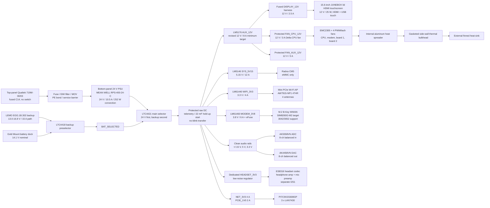
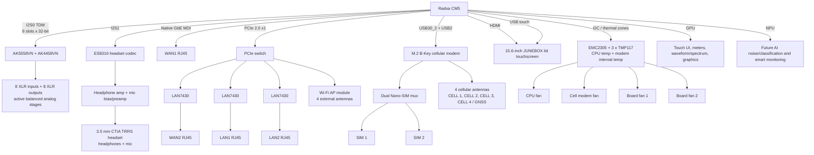

# System Block Diagram

## Purpose

Top-level block diagram for the Radxa CM5 ProComm carrier. This captures the
selected architecture before schematic partitioning.

## Power And System Blocks

## Data And I/O Blocks

## Partition Notes

- `PWR-SELECT` is a separate bottom-mounted low-voltage source-selector board.
- `CM5-CARRIER` contains digital, network, radio, display/USB, headset, fan
  control, and downstream low-voltage regulation.
- `AUDIO-8X8` contains the AKM converters and all 16 active-balanced XLR paths.
- Heavy XLR connectors are panel-supported, with PCB/harness interconnects.
- The AC/DC PSU is bottom-panel-mounted; the top panel carries the fused C14
  inlet and connector/PCB panel.
- The Wi-Fi AP rail and cellular modem rail are separate supplies.
- Source transfer is no-blink/no-mute when a valid backup source is present;
  protected raw DC and critical downstream rails need hold-up.
- The cellular modem gets both a heatsink/thermal spreader and a dedicated fan.
- The two board/enclosure fans are controlled from board temperature sensors.
- The real heat exit is a gasketed metal side-wall bulkhead connected to an
  external finned heat sink; the Pelican plastic wall is not used as a heat sink.
- Audio/SIP runtime should stay on protected CPU resources; GPU/NPU acceleration
  is for UI, meters, graphics, and future AI monitoring.
